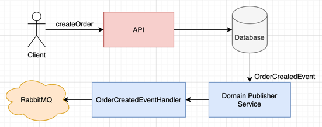

# Domain Driven Design Template

This is an example template if you want to implement domain driven design in Spring Framework.

## Overview
### Domain
Domain layer contains aggregate roots, value objects, domain exceptions, entities, domain events and repository abstractions.
### Application
Application layer contains use cases like commands and queries. It also includes service exceptions, service abstractions.
### Infrastructure
Infrastructure layer contains classes for accessing external resources. It should also implement abstractions that defined Domain and Application layers.